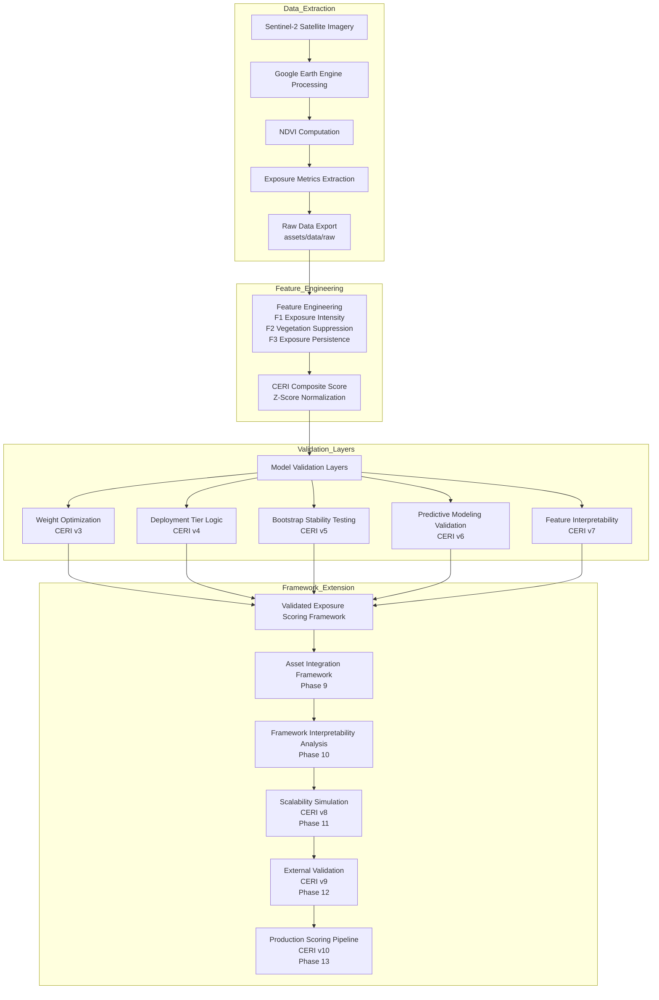

# Satellite Environmental Risk Engine  
### Mining Exposure Scoring using Sentinel-2 Satellite Data

---

# Overview

This repository documents the end-to-end development of a satellite-derived environmental exposure scoring system focused on mining assets.

The framework:

- Extracts multi-spectral satellite imagery  
- Computes vegetation exposure indicators (NDVI-based metrics)  
- Tracks multi-year environmental stability  
- Quantifies sustained industrial land exposure  
- Formalizes a **Corporate Environmental Risk Index (CERI)**  
- Converts composite scores into deterministic deployment-ready risk tiers  
- Validates score robustness through statistical resampling  
- Evaluates feature predictability using supervised machine learning  
- Provides interpretable environmental exposure signals  
- Demonstrates scalable application across mining portfolios  

The project evolves from **satellite signal extraction → exposure scoring → statistical validation → scalable risk analytics**.

This work sits at the intersection of:

- Geospatial analytics  
- Remote sensing  
- Statistical feature engineering  
- Risk modeling  
- Applied machine learning  

---

# System Pipeline

The framework transforms raw satellite imagery into a structured exposure scoring system through several stages.

### Pipeline Interpretation

The pipeline integrates multiple analytical layers that transform raw satellite observations into a structured environmental exposure scoring system.

These layers include:

- **Satellite data ingestion and preprocessing**
- **Vegetation exposure signal extraction**
- **Feature engineering and statistical normalization**
- **Composite exposure scoring**
- **Optimization and governance validation**
- **Deployment-ready tier classification**
- **Statistical robustness evaluation**
- **Machine learning compatibility validation**
- **Interpretability analysis**
- **Framework scalability testing**

Each stage is implemented as a reproducible computational step within the repository, allowing the full scoring framework to be regenerated from raw satellite data.

---

# Motivation

Corporate ESG disclosures are largely self-reported and episodically verified.

Satellite data enables:

- Independent exposure monitoring  
- Consistent temporal evaluation  
- Scalable cross-asset comparison  

This project evaluates whether satellite-derived vegetation exposure metrics can serve as structured, comparable proxies for industrial environmental risk.

The framework aims to demonstrate how **satellite analytics can support systematic environmental risk screening for mining assets.**

---

# Development Progression

## Phase 0 — Conceptual Grounding

- GIS fundamentals consolidated  
- Raster vs vector clarified  
- NDVI spectral logic validated  
- Seasonal variability examined  

---

## Phase 1 — Signal Extraction Pipeline

- Spatial buffer-based analysis implemented  
- Sentinel-2 harmonized dataset integrated  
- Median compositing operational  
- Multi-year NDVI extraction (2019–2023)  
- Temporal structuring established  

---

## Phase 2 — Deep Case Study Validation

**Carajás Mine (Brazil)**

- Multi-scale buffer refinement (5 km → 1 km)  
- Metric evolution (Mean NDVI → Low NDVI Fraction)  
- Seasonal instability resolved via full-year compositing  
- Pit-centered spatial anchoring  
- Persistent exposed footprint quantified  

See:

`notes/case-study-carajas.md`

---

## Phase 3 — Cross-Site Generalization

**Gevra Coal Mine (India)**

- Pipeline validation across new geography  
- Stable exposure extraction (2019–2023)  
- Cross-site comparative analysis  

See:

`notes/case-study-gevra.md`  
`experiments/python/comparative_analysis.ipynb`

---

## Phase 4 — Portfolio-Level Risk Modeling (CERI v1 → v2)

Two additional assets were integrated:

- **Bingham Canyon (USA)**  
- **Grasberg Mine (Indonesia)**  

Portfolio spans four geographically diverse mining operations.

### CERI v1

Two-asset prototype demonstrating feature design and composite scoring.

### CERI v2 (Governance Baseline)

Four-asset portfolio model featuring:

- Standardized feature engineering (F1, F2, F3)  
- Z-score normalization  
- Composite risk scoring (CERI_z)  
- KMeans clustering  
- Silhouette-based validation  
- Feature space geometry analysis  

Final feature layer exported to:

`assets/data/processed/ceri_v2_feature_layer.csv`

CERI v2 remains the official scoring baseline.

---

## Phase 5 — Weight Optimization & Robustness Validation (CERI v3)

Introduced data-driven weight optimization using clustering quality metrics.

Key analyses:

- Structured weight grid search  
- Silhouette maximization  
- Ranking stability evaluation  

Governance decision retained **CERI v2 as the baseline configuration**.

See:

`notes/ceri-v3-weight-optimization.md`  
`notes/ceri-governance-decision.md`

---

## Phase 6 — Deployment Tier Logic (CERI v4)

Operationalized deterministic risk classification.

Includes:

- Z-score thresholds  
- Tier segmentation (High / Moderate / Low Risk)  
- Confidence margin scoring  

See:

`notes/ceri-v4-deployment.md`  
`experiments/python/ceri/ceri_v4_deployment_logic.ipynb`

---

## Phase 7 — Bootstrap Stability Validation (CERI v5)

Evaluated score robustness using **1000 bootstrap simulations**.

Key findings:

- Exposure scores remain tightly distributed  
- Asset rankings remain structurally stable  
- Tier assignments remain consistent under resampling  

This confirms that the scoring framework behaves as a **stable comparative exposure signal rather than a fragile point estimate**.

See:

`notes/ceri_v5_bootstrap_stability.md`  
`experiments/python/ceri/ceri_v5_bootstrap_stability.ipynb`

---

## Phase 8 — Predictive Modeling Validation (CERI v6)

Evaluated whether engineered exposure features can reconstruct the composite exposure score.

Models tested:

- Linear Regression  
- Random Forest Regression  

Evaluation method:

- Leave-One-Out Cross Validation (LOOCV)  
- RMSE comparison across models  
- Feature importance analysis  

This stage demonstrates that the engineered exposure features contain meaningful predictive structure.

See:

`notes/ceri_v6_predictive_modeling.md`  
`experiments/python/ceri/ceri_v6_predictive_modeling.ipynb`

---

## Phase 9 — Asset Integration Framework

Phase 9 formalizes the workflow required to integrate additional mining assets into the exposure scoring framework.

The deterministic workflow includes:

1. Identify mining asset coordinates  
2. Execute satellite extraction via Google Earth Engine  
3. Export yearly vegetation exposure metrics  
4. Generate engineered exposure features (F1, F2, F3)  
5. Compute the composite exposure score (CERI_z)  
6. Assign the deployment risk tier  

This stage demonstrates that the system functions as a **scalable exposure scoring pipeline rather than a fixed portfolio experiment**.

See:

`notes/new_asset_integration.md`

---

## Phase 10 — Feature Interpretability (CERI v7)

Introduced interpretability analysis to explain how engineered exposure signals influence the composite risk score.

Analyses include:

- Feature correlation analysis  
- Feature vs score relationship visualization  
- Sensitivity curves  
- Feature contribution analysis  

Key insight:

- **Exposure intensity (F1)** is the dominant driver of the composite score  
- Vegetation suppression reinforces exposure signals  
- Persistence captures long-term environmental disturbance stability  

See:

`notes/ceri_v7_feature_interpretability.md`  
`experiments/python/ceri/ceri_v7_feature_interpretability.ipynb`

---

## Phase 11 — Scalability Simulation (CERI v8)

Evaluates how the scoring framework behaves when applied to a larger mining asset population.

Synthetic mining assets are generated using the empirical statistical structure of the observed feature space.

Analysis includes:

- Multivariate feature simulation  
- Synthetic asset generation  
- Composite score computation  
- Score distribution analysis  
- Tier segmentation evaluation  

This stage demonstrates that the framework **scales beyond the initial four-asset prototype**.

See:

`experiments/python/ceri/ceri_v8_scalability_simulation.ipynb`

---

## Phase 12 — External Validation (CERI v9)

Introduces external validation using independent disturbance indicators.

The objective is to verify whether higher exposure scores correspond to observable environmental disturbance signals.

Analyses include:

- Proxy disturbance signal generation  
- Cross-asset correlation analysis  
- External validation visualization  

This stage evaluates the **external validity of the exposure scoring framework**.

---

## Phase 13 — Production Scoring Pipeline (CERI v10)

Introduces a deterministic scoring engine capable of evaluating new mining assets.

The scoring pipeline performs:

- Feature ingestion  
- Composite score computation  
- Deterministic tier assignment  
- Structured scoring output generation  

This stage demonstrates how the framework can operate as a **production-style environmental exposure scoring system**.

---

# Repository Structure

- `notes/` — Conceptual documentation, case studies, governance explanations  
- `experiments/` — Google Earth Engine scripts and modeling notebooks  
- `assets/` — Generated datasets and visualization outputs  
- `references/` — Supporting datasets and literature  

---

# Reproducibility

All outputs are reproducible via:

1. Running the corresponding GEE extraction script  
2. Exporting CSV results  
3. Running associated Python notebooks  

Covered assets:

- Carajás (Brazil)  
- Gevra (India)  
- Bingham Canyon (USA)  
- Grasberg (Indonesia)

Version progression:
CERI V2-> V3-> V4-> V5-> V6-> V7-> V8-> V9-> V10

---

# Project Positioning

This repository represents:

- a structured geospatial modeling system  
- a versioned environmental exposure scoring framework  
- a governance-validated composite model  
- a deployment-ready risk classification layer  
- a statistically validated exposure scoring system  
- a machine-learning compatible feature engineering pipeline  
- an interpretable exposure scoring architecture  
- a scalable satellite-based environmental risk analytics framework  

The emphasis is on:

- statistical rigor  
- interpretability  
- robustness testing  
- governance discipline  
- reproducible modeling workflows  

Development proceeds in **deliberate, documented stages rather than ad hoc experimentation.**
