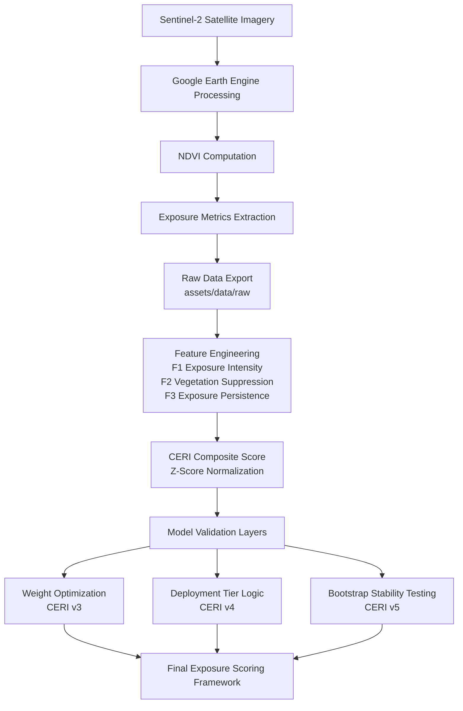

# Satellite-Based Exposure Scoring Framework  
### Multi-Spectral Mining Exposure Quantification & Cross-Asset Risk Scoring

---

## Overview

This repository documents the end-to-end development of a satellite-derived environmental exposure scoring system focused on mining assets.

The framework:

- Extracts multi-spectral satellite imagery  
- Computes vegetation exposure indicators (NDVI-based metrics)  
- Tracks multi-year environmental stability  
- Quantifies sustained industrial land exposure  
- Formalizes a Corporate Environmental Risk Index (CERI)  
- Converts composite scores into deterministic deployment-ready risk tiers  
- Validates score robustness through statistical resampling  

The project has evolved from signal validation to portfolio-level modeling, optimization, governance validation, deployment-tier logic, and statistical robustness testing.

This work sits at the intersection of:

- Geospatial analytics  
- Remote sensing  
- Statistical feature engineering  
- Risk modeling  
- Applied machine learning  

---

# System Pipeline

The framework transforms raw satellite imagery into a structured exposure scoring system through several stages:

### Pipeline Interpretation

The pipeline integrates multiple analytical layers that transform raw satellite observations into a structured environmental exposure scoring system.

These layers include:

- **Satellite data ingestion and preprocessing**
- **Vegetation exposure signal extraction**
- **Feature engineering and statistical normalization**
- **Composite exposure scoring**
- **Optimization and governance validation**
- **Deployment-ready tier classification**
- **Statistical robustness evaluation**

Each stage is implemented as a reproducible computational step within the repository, allowing the full scoring framework to be regenerated from raw satellite data.

---

## Motivation

Corporate ESG disclosures are largely self-reported and episodically verified.

Satellite data enables:

- Independent exposure monitoring  
- Consistent temporal evaluation  
- Scalable cross-asset comparison  

This project evaluates whether satellite-derived vegetation exposure metrics can serve as structured, comparable proxies for industrial environmental risk.

Portfolio-level validation, clustering analysis, weight optimization, deployment-tier logic, and bootstrap stability testing have been implemented to assess structural robustness and operational readiness.

---

# Development Progression

### Phase 0 — Conceptual Grounding
- GIS fundamentals consolidated  
- Raster vs vector clarified  
- NDVI spectral logic validated  
- Seasonal variability examined  

---

### Phase 1 — Signal Extraction Pipeline
- Spatial buffer-based analysis implemented  
- Sentinel-2 harmonized dataset integrated  
- Median compositing operational  
- Multi-year NDVI extraction (2019–2023)  
- Temporal structuring established  

---

### Phase 2 — Deep Case Study Validation

**Carajás Mine (Brazil)**

- Multi-scale buffer refinement (5 km → 1 km)  
- Metric evolution (Mean NDVI → Low NDVI Fraction)  
- Seasonal instability resolved via full-year compositing  
- Pit-centered spatial anchoring  
- Persistent exposed footprint quantified  

See: `notes/case-study-carajas.md`

---

### Phase 3 — Cross-Site Generalization

**Gevra Coal Mine (India)**

- Pipeline validation across new geography  
- Stable exposure extraction (2019–2023)  
- Cross-site comparative analysis  

See:

- `notes/case-study-gevra.md`  
- `experiments/python/comparative_analysis.ipynb`

---

### Phase 4 — Portfolio-Level Risk Modeling (CERI v1 → v2)

Two additional assets were integrated:

- **Bingham Canyon (USA)**  
- **Grasberg Mine (Indonesia)**  

Portfolio spans four geographically diverse mining operations.

#### CERI v1  
Two-asset prototype demonstrating feature design and composite scoring.

#### CERI v2 (Governance Baseline)

Four-asset portfolio model featuring:

- Standardized feature engineering (F1, F2, F3)  
- Z-score normalization  
- Composite risk scoring (CERI_z)  
- Weight sensitivity testing  
- Geometric feature space analysis  
- KMeans clustering (k=2, k=3)  
- Silhouette-based validation  

Final feature layer exported to:

`assets/data/processed/ceri_v2_feature_layer.csv`

CERI v2 remains the official scoring baseline.

---

### Phase 5 — Weight Optimization & Robustness Validation (CERI v3)

CERI v3 introduced data-driven weight optimization:

- Structured weight grid search  
- Silhouette maximization (k = 3)  
- Ranking shift quantification  
- Spearman & Kendall stability analysis  
- Governance decision framework  

Key findings:

- Optimization improves geometric separation  
- Extreme-tier assets remain stable  
- Moderate-tier ordering shifts under heavy stability weighting  
- Ranking stability remains strong (Spearman ≈ 0.80)

Governance Decision:

CERI v2 retained as baseline.  
CERI v3 serves as analytical validation layer.

See:

- `notes/ceri-v3-weight-optimization.md`  
- `notes/ceri-governance-decision.md`

---

### Phase 6 — Deployment Tier Logic (CERI v4)

CERI v4 operationalizes the framework into a deterministic classification system.

Includes:

- Z-score threshold-based tier assignment  
- High / Moderate / Low risk segmentation  
- Margin-based confidence scoring  
- Confidence band labeling (High / Medium / Low)  
- Deployment-ready output table  

No clustering dependency at deployment stage.

CERI v4 converts validated composite scoring into a stable, production-style risk classification layer.

See:

- `notes/ceri-v4-deployment.md`  
- `experiments/python/ceri/ceri_v4_deployment_logic.ipynb`

---

### Phase 7 — Bootstrap Stability Validation (CERI v5)

CERI v5 evaluates score robustness under simulated temporal variation.

Includes:

- 1000 bootstrap simulations  
- Score distribution analysis  
- Ranking robustness evaluation  
- Tier classification stability assessment  

Key findings:

- Exposure scores remain tightly distributed  
- Cross-asset ranking remains structurally stable  
- Tier assignments remain consistent under resampling  

Bootstrap validation confirms that the framework behaves as a **stable comparative exposure signal rather than a fragile point estimate.**

See:

- `notes/ceri_v5_bootstrap_stability.md`  
- `experiments/python/ceri/ceri_v5_bootstrap_stability.ipynb`

---

# Repository Structure

- `notes/` — Conceptual documentation, case studies, governance, and deployment logic  
- `experiments/` — GEE extraction scripts and Python modeling notebooks  
- `assets/` — Generated datasets and visualization outputs  
- `references/` — Supporting datasets and literature  

---

# Reproducibility

All outputs are reproducible via:

1. Running the corresponding GEE extraction script  
2. Exporting CSV results  
3. Running associated Python notebooks  

Covered assets:

- Carajás (Brazil)  
- Gevra (India)  
- Bingham Canyon (USA)  
- Grasberg (Indonesia)

CERI v2 outputs are versioned and frozen.  
CERI v3 operates exclusively on the frozen v2 feature layer.  
CERI v4 applies deterministic tier logic without refitting models.  
CERI v5 evaluates statistical stability using bootstrap resampling.

---

# Project Positioning

This repository represents:

- A structured geospatial modeling system  
- A versioned environmental exposure scoring framework  
- A governance-validated composite model  
- A deployment-ready risk classification layer  
- A statistically validated exposure scoring system  
- A modular foundation for scalable risk analytics  

The emphasis is on:

- Statistical rigor  
- Geometric interpretability  
- Robustness testing  
- Governance discipline  
- Deterministic deployment logic  
- Version-controlled evolution  

Development proceeds in deliberate, documented stages rather than ad hoc experimentation.
