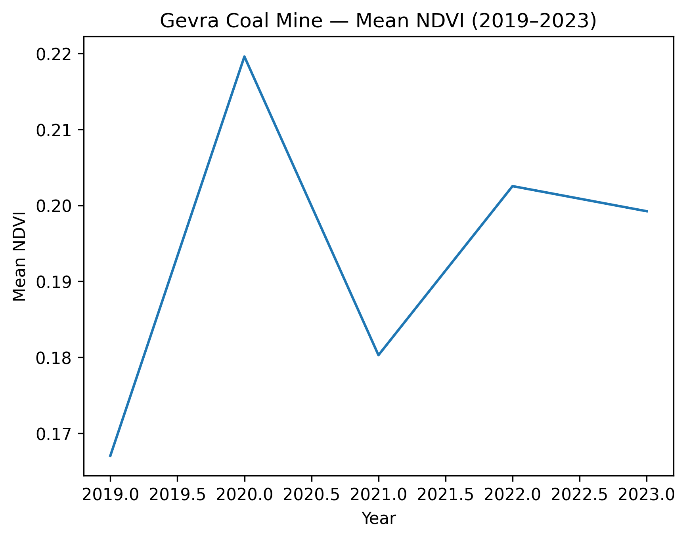
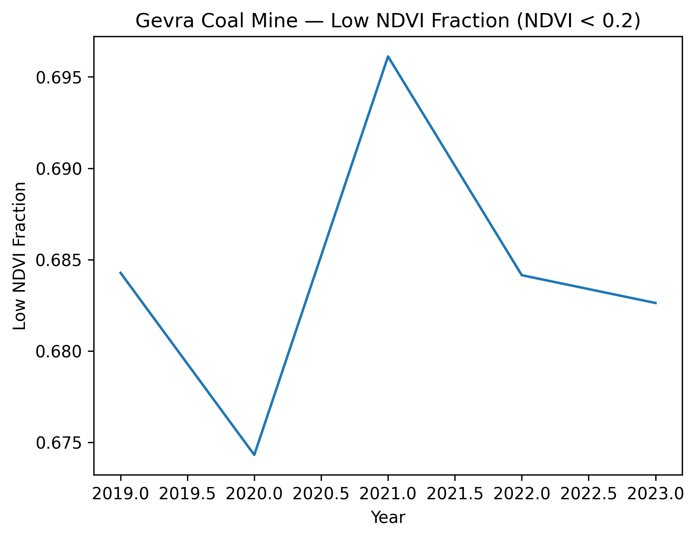

# Case Study 02 — Gevra Coal Mine (India)

## Objective

Evaluate whether the validated satellite-derived environmental exposure pipeline generalizes across geography and mineral type.

Following deep methodological validation using Carajás (Brazil), this case study applies the finalized pit-centered full-year exposure model to Gevra Coal Mine (India).

---

## Site Selection

Gevra Coal Mine is one of the largest open-pit coal mines in Asia, located in Chhattisgarh, India.

The site was selected because:

- It contains extensive exposed excavation zones.
- It differs geographically from Carajás (South America → India).
- It differs in mineral type (Iron Ore → Coal).
- It provides an opportunity to test cross-site generalization.

---

## Methodology

This case study directly applies the validated Phase 2 pipeline:

- Pit-centered coordinate (visually confirmed in satellite view)
- 1 km circular buffer
- Sentinel-2 Surface Reflectance (Harmonized)
- Full-year median composite (Jan–Dec)
- Years analyzed: 2019–2023
- Metrics extracted:
    - Mean NDVI
    - Low NDVI Fraction (NDVI < 0.2)

No iterative refinement was required, as methodology was stabilized in Phase 2.

---

## Results

| Year | Mean NDVI | Low NDVI Fraction |
|------|-----------|------------------|
| 2019 | 0.167 | 0.684 |
| 2020 | 0.220 | 0.674 |
| 2021 | 0.180 | 0.696 |
| 2022 | 0.203 | 0.684 |
| 2023 | 0.199 | 0.683 |

---

## Visual Trends

### Mean NDVI

### Low NDVI Fraction

---

## Interpretation

Unlike Carajás, Gevra exhibits:

- Higher mean NDVI (~0.17–0.22)
- Lower exposed dominance (~68–70%)

This indicates:

- Mixed excavation and vegetated areas within the 1 km buffer.
- Less concentrated exposed surface compared to Carajás.
- Stable multi-year industrial footprint.

Importantly, the signal is:

- Consistent across all five years.
- Stable under full-year compositing.
- Clearly distinguishable from high-intensity sites like Carajás.

---

## Methodological Insights

1. The exposure pipeline generalizes across continents.
2. The pipeline generalizes across mineral types.
3. Exposure intensity varies across assets.
4. Low NDVI fraction provides a robust exposed-land proxy.
5. Full-year compositing stabilizes regional seasonal variability.

---

## Conclusion

The validated pit-centered full-year vegetation exposure pipeline successfully generalizes to Gevra Coal Mine.

This confirms that satellite-derived vegetation metrics can:

- Quantify exposed industrial footprint.
- Distinguish exposure intensity across assets.
- Produce stable multi-year environmental signals.

Phase 3 establishes cross-site generalization and prepares the foundation for structured risk scoring.
