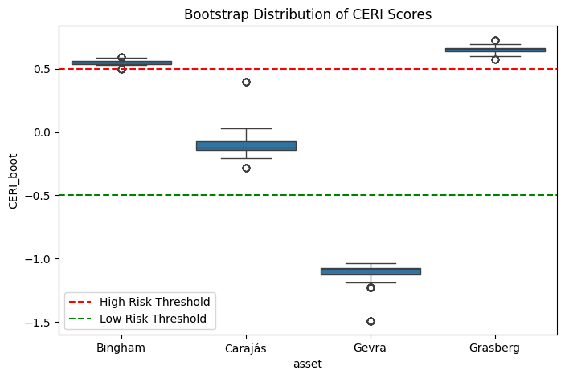

# CERI v5 — Bootstrap Stability Analysis

## Objective

CERI v5 evaluates the **statistical robustness** of the Corporate Environmental Risk Index (CERI) under sampling variability.

While earlier phases validated feature design, score construction, and weight sensitivity, this phase addresses an important modeling question:

> How stable are exposure scores and rankings when the underlying environmental observations vary slightly?

To answer this, bootstrap resampling is used to simulate alternative environmental histories for each asset.

The goal is to quantify:

- score variability  
- ranking stability  
- tier classification robustness  

This ensures that the exposure scoring framework does not produce fragile or unstable results.

---

## Methodology

### Data Structure

Each asset contains annual exposure measurements across five years:

2019–2023

For each year, the dataset includes:

- Mean NDVI
- Low NDVI Fraction (NDVI < 0.2)

These values feed the feature engineering layer used in the CERI scoring system.

---

### Bootstrap Resampling

Bootstrap simulation is performed by randomly resampling the observed years **with replacement**.

For each iteration:

1. Five years are sampled with replacement from the available observations.
2. Feature engineering is recomputed:
   - F1 — Exposure Intensity  
   - F2 — Vegetation Suppression  
   - F3 — Persistence
3. Z-score normalization is applied.
4. The composite score is recomputed using the CERI v2 baseline weights:
CERI = 0.5·F1 + 0.3·F2 + 0.2·F3

This process is repeated **1000 times**, producing a distribution of possible exposure scores for each asset.

---

## Feature Definitions

The CERI scoring framework relies on three engineered features:

### F1 — Exposure Intensity

Mean proportion of land within the analysis buffer exhibiting low vegetation signal.

Higher values indicate larger exposed surface area.

---

### F2 — Vegetation Suppression

Computed as:

This process is repeated **1000 times**, producing a distribution of possible exposure scores for each asset.

---

## Feature Definitions

The CERI scoring framework relies on three engineered features:

### F1 — Exposure Intensity

Mean proportion of land within the analysis buffer exhibiting low vegetation signal.

Higher values indicate larger exposed surface area.

---

### F2 — Vegetation Suppression

Computed as:
F2 = 1 − mean NDVI

This captures the degree to which vegetation health is suppressed.

---

### F3 — Exposure Persistence

Persistence measures the stability of exposure across time.

It is calculated as the inverse normalized variance of the Low NDVI Fraction:
F3 = 1 − normalized variance(low_ndvi_fraction)

High persistence indicates long-term structural land exposure.

---

## Simulation Design

Bootstrap parameters:

| Parameter | Value |
|----------|------|
Iterations | 1000
Years sampled | 5
Sampling method | With replacement
Scoring weights | (0.5, 0.3, 0.2)

Each simulation produces:

- exposure score
- asset ranking
- potential tier assignment

This allows the construction of empirical score distributions.

---

## Results

### Score Distribution

The bootstrap distributions of CERI scores are summarized below.

| Asset | Mean Score | Std Dev |
|------|------|------|
Grasberg | 0.653 | 0.022 |
Bingham | 0.549 | 0.014 |
Carajás | -0.105 | 0.078 |
Gevra | -1.098 | 0.056 |

---

## Visualization

To better understand score variability, bootstrap score distributions are visualized below.

The boxplot shows the spread of simulated CERI scores for each asset across 1000 bootstrap iterations.

This visualization highlights:

- tight score concentration for structurally exposed assets
- moderate variability for boundary assets
- strong separation between high- and low-exposure sites

Example visualization:

---

### Interpretation

#### Grasberg

Grasberg exhibits consistently high exposure scores across simulations.

Score variability remains extremely low, indicating a stable and persistent exposure footprint.

---

#### Bingham Canyon

Bingham Canyon shows the lowest variance among the high-exposure assets.

Scores remain tightly concentrated near the high-risk threshold.

This confirms strong structural exposure at the site.

---

#### Carajás

Carajás shows the largest variability among assets.

This behavior is expected because the site lies closer to the moderate exposure regime, where smaller year-level variations can influence feature values.

Importantly, even under bootstrap perturbation, Carajás does not exhibit extreme score instability.

---

#### Gevra

Gevra consistently remains in the low exposure regime across simulations.

This indicates that the asset is structurally separated from the other mining operations in terms of vegetation exposure.

---

## Ranking Stability

Across bootstrap simulations, the asset ranking remains structurally stable:

High persistence indicates long-term structural land exposure.

---

## Simulation Design

Bootstrap parameters:

| Parameter | Value |
|----------|------|
Iterations | 1000
Years sampled | 5
Sampling method | With replacement
Scoring weights | (0.5, 0.3, 0.2)

Each simulation produces:

- exposure score
- asset ranking
- potential tier assignment

This allows the construction of empirical score distributions.

---

## Results

### Score Distribution

The bootstrap distributions of CERI scores are summarized below.

| Asset | Mean Score | Std Dev |
|------|------|------|
Grasberg | 0.653 | 0.022 |
Bingham | 0.549 | 0.014 |
Carajás | -0.105 | 0.078 |
Gevra | -1.098 | 0.056 |

---

### Interpretation

#### Grasberg

Grasberg exhibits consistently high exposure scores across simulations.

Score variability remains extremely low, indicating a stable and persistent exposure footprint.

---

#### Bingham Canyon

Bingham Canyon shows the lowest variance among the high-exposure assets.

Scores remain tightly concentrated near the high-risk threshold.

This confirms strong structural exposure at the site.

---

#### Carajás

Carajás shows the largest variability among assets.

This behavior is expected because the site lies closer to the moderate exposure regime, where smaller year-level variations can influence feature values.

Importantly, even under bootstrap perturbation, Carajás does not exhibit extreme score instability.

---

#### Gevra

Gevra consistently remains in the low exposure regime across simulations.

This indicates that the asset is structurally separated from the other mining operations in terms of vegetation exposure.

---

## Ranking Stability

Across bootstrap simulations, the asset ranking remains structurally stable:
Grasberg → Bingham → Carajás → Gevra

The separation between the highest and lowest exposure assets is sufficiently large that ranking reversals are extremely unlikely.

This indicates that the composite exposure score is not overly sensitive to small fluctuations in environmental measurements.

---

## Tier Classification Stability

The deployment logic introduced in CERI v4 defines risk tiers using deterministic thresholds:

| Tier | Condition |
|-----|-----|
High Risk | CERI ≥ 0.5
Moderate Risk | −0.5 < CERI < 0.5
Low Risk | CERI ≤ −0.5

Bootstrap results confirm that:

- Grasberg consistently remains **High Risk**
- Gevra consistently remains **Low Risk**
- Carajás consistently remains **Moderate Risk**
- Bingham occasionally approaches the High/Moderate boundary, reflecting the smaller confidence margin observed in the deployment layer

This behavior aligns with the earlier **confidence band analysis**.

---

## Key Insights

Bootstrap analysis demonstrates several important properties of the scoring framework:

### 1. Strong Structural Separation

Extreme exposure assets remain consistently separated across simulations.

---

### 2. Realistic Sensitivity

Assets located near classification boundaries show moderate variability, which reflects realistic environmental fluctuations.

---

### 3. Ranking Robustness

The cross-asset ordering remains stable even under repeated resampling.

---

### 4. Stable Risk Tiering

Risk tiers defined in the deployment layer remain largely invariant across bootstrap simulations.

---
## Limitations

Several limitations should be noted:

1. **Small Portfolio Size**

The analysis currently includes four mining assets.  
While sufficient for demonstrating framework behavior, larger asset coverage would improve statistical generalization.

2. **Synthetic Portfolio Context**

The framework evaluates exposure characteristics rather than real regulatory or financial outcomes.  
Future work could integrate external datasets such as environmental violations, regulatory penalties, or ESG ratings.

3. **Temporal Resolution**

The analysis uses annual composite observations.  
Higher temporal resolution (monthly or seasonal) could capture more granular environmental dynamics.

4. **Single-Signal Exposure**

The current system measures vegetation exposure only.  
Additional environmental signals (e.g., land cover change, dust plumes, or water disturbance) could enrich exposure characterization.

---

## Modeling Implications

These results suggest that the CERI framework:

- captures persistent structural exposure signals
- is not overly sensitive to minor data perturbations
- produces stable comparative rankings
- supports deterministic risk classification

Bootstrap validation therefore provides an additional layer of **statistical confidence** in the scoring system.

---

## Framework Progression

At this stage, the system includes:

1. Satellite extraction pipeline (Sentinel-2 / Google Earth Engine)
2. Feature engineering layer (F1, F2, F3)
3. Composite exposure scoring (CERI v2 baseline)
4. Weight optimization and governance validation (CERI v3)
5. Deterministic deployment tier logic (CERI v4)
6. Bootstrap stability validation (CERI v5)

---

## Next Phase

The next phase introduces a **predictive modeling layer** that evaluates how exposure features behave under supervised machine learning frameworks.

This will allow:

- model comparison
- cross-validation
- feature importance analysis
- predictive performance evaluation

---

## Key Takeaways

Bootstrap analysis confirms several important properties of the exposure scoring system:

- Exposure scores remain **statistically stable under temporal resampling**
- Asset ranking is **robust across simulated environmental histories**
- Risk tier assignments remain **consistent for structurally separated assets**
- Moderate variability appears only near classification boundaries

These results indicate that the CERI framework provides a **reliable comparative exposure signal** rather than a fragile point estimate.
