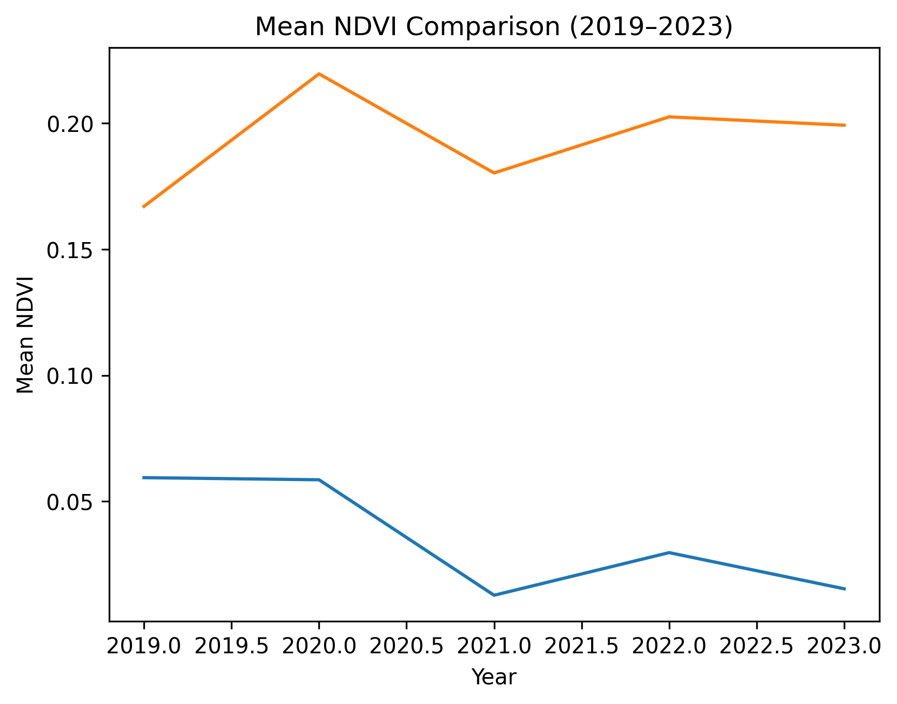
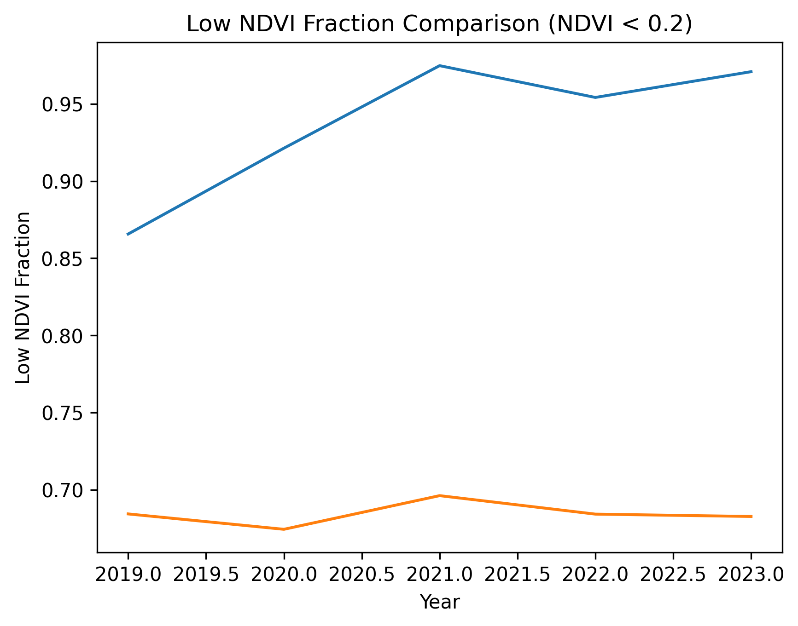

# Comparative Analysis — Carajás vs Gevra

## Objective

Compare satellite-derived environmental exposure signals across two large open-pit mining operations:

- Carajás Mine (Brazil)
- Gevra Coal Mine (India)

The objective is to evaluate:

- Cross-geographical generalization
- Exposure intensity differentiation
- Signal stability across industrial contexts

---

## Average Metrics (2019–2023)

| Site      | Avg Mean NDVI | Avg Low NDVI Fraction |
|-----------|---------------|----------------------|
| Carajás  | ~0.03         | ~0.95                |
| Gevra    | ~0.19         | ~0.68                |

---

## Comparative Visualizations

### Mean NDVI Comparison

### Low NDVI Fraction Comparison

---

## Key Observations

### 1. Exposure Intensity Contrast

Carajás:
- Extremely low NDVI
- ~95% exposed surface
- Highly concentrated excavation footprint

Gevra:
- Moderate NDVI
- ~68–70% exposed surface
- Mixed exposed and vegetated areas

---

### 2. Stability Across Years

Both sites exhibit:

- Minimal year-to-year volatility
- Stable exposure profiles
- No large vegetation recovery signals

This suggests persistent industrial footprint.

---

### 3. Generalization Confirmed

The same pipeline:

- Produces stable results in South America and India.
- Distinguishes exposure intensity.
- Maintains interpretability across contexts.

This demonstrates methodological robustness.

---

## Analytical Implications

The exposure signal is:

- Quantifiable
- Comparable across assets
- Multi-year stable
- Suitable for structured scoring

Exposure intensity becomes the first candidate feature for a satellite-derived risk scoring framework.

---

## Transition to Risk Architecture

With two validated sites and distinguishable exposure magnitudes, the system now supports:

- Exposure ranking
- Relative intensity comparison
- Structured feature engineering

This comparative validation establishes the foundation for formal risk aggregation in the next phase.
